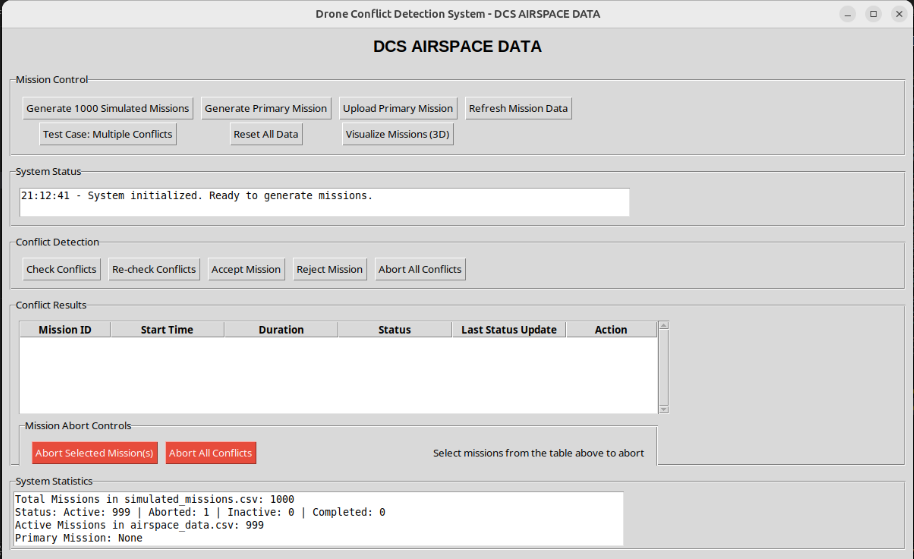

# Drone Mission Conflict Detection System — GUI

A graphical user interface for detecting conflicts between planned drone missions.  
This project provides a friendly desktop UI to load drone mission files (waypoints / flight plans), visualize missions, detect potential conflicts (spatial/temporal overlaps), and export conflict reports.

---

## Table of contents

- [About](#about)  
- [Features](#features)  
- [Demo / Screenshots](#demo--screenshots)  
- [Installation](#installation)  
- [Usage](#usage)  
- [Configuration](#configuration)  
- [File formats / Inputs](#file-formats--inputs)  
- [Output / Reports](#output--reports)  
- [Troubleshooting](#troubleshooting)  
- [Development & Contributing](#development--contributing)  
- [License](#license)  
- [Credits](#credits)

---

## About

**Drone Mission Conflict Detection System — GUI** helps operators and planners discover possible conflicts between drone missions before deployment. Typical use cases:

- Detect spatial (path) intersections between missions.  
- Detect temporal overlap where multiple drones occupy the same airspace at conflicting times.  
- Visualize missions on an interactive map or simple XY plot and review conflict severity.  
- Export conflict reports (CSV) for logging and post-processing.

Repository: `KunalChattaraj/drone_mission-conflict_detection-system_gui`.

---

## Features

- Load one or more mission files (common waypoint/mission formats).  
- Visual map / plot visualization of missions and waypoints.  
- Automatic conflict detection (spatial and temporal heuristics).  
- Highlight conflicts by severity (critical / high / moderate / safe).  
- Export conflict report as CSV.  
- Simple, lightweight desktop GUI (single Python script `gui.py` included in repo).

---

## Demo / Screenshots

Here’s an example of the Drone Mission Conflict Detection System GUI in action:

<p align="center">
  
</p>

The GUI provides controls for mission generation, conflict checking, mission management, and displays system statistics and conflict results in real-time.

---

## Installation

Recommended: create a Python virtual environment.

```bash
# Create & activate a venv (Linux / macOS)
python3 -m venv .venv
source .venv/bin/activate

# Windows (PowerShell)
python -m venv .venv
.venv\Scripts\Activate.ps1
```

Install dependencies (example). Replace with exact requirements from your project:

```bash
pip install --upgrade pip
```

```bash
pip install numpy pandas shapely matplotlib pyproj
# pip install tk         # tkinter usually comes with Python
```

---

## Usage

Run the GUI script:

```bash
python gui.py
```

Basic workflow:

1. Launch `gui.py`.  
2. Use **File → Open** (or the provided "Load mission" button) to load mission files (CSV / JSON / MAVLink/etc).  
3. Visualize missions on the canvas/map.  
4. Click **Detect Conflicts** to run the detection engine.  
5. Review highlighted conflicts and export a report.

---

## File formats / Inputs

Supported input mission formats (customize as needed):

- CSV with columns: `mission_id, waypoint_id, lat, lon, alt, time`   

---

## Output / Reports

Exported report types:

- CSV: list of conflict records with fields `mission_a`, `mission_b`, `conflict_type`, `start_time`, `end_time`, `severity`, `notes`.  
- Visual overlay export (e.g., PNG snapshot) of the map with conflicts.

Example CSV header:

```
mission_a,mission_b,conflict_type,start_time,end_time,severity,distance_m,notes
```

---

## Troubleshooting

- GUI doesn't start: ensure you're using Python 3.8+ and required GUI libraries are installed.  
- Missing dependency errors: install via `pip install <missing>` 
- Unexpected mission format: verify CSV headers and timestamps are in UTC and consistent.

---

## Development & Contributing

Contributions welcome!

Suggested workflow:

1. Fork the repo.  
2. Create a feature branch: `git checkout -b feat/my-feature`  
3. Commit and push.  
4. Open a pull request with a clear description.

---

## Project structure

```
├── gui.py
└── README.md
```

---

## Contributors

- Original author: Kunal Chattaraj

---
